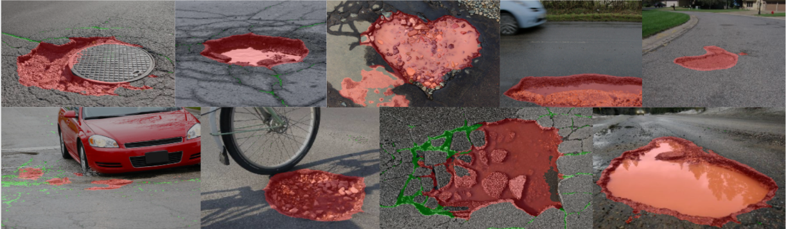

# 
 HCMUS Team at SHREC'22: Pothole and crack detection on road pavement 

    <i>Predictions of Masked Soft CPS on unseen data "in the wild"</i>

----------------------------------------------------------

## Table of contents

- [About the challenge](./docs/SHREC22.md)
- [Our methods](./docs/SUBMISSION.md)
- [Datasets](./docs/DATA.md)
- How to run:
  - [Training and evaluation](./docs/CODE.md)
  - [Inference](./docs/INFERENCE.md)
- [Results](./docs/RESULTS.md)
- [References](./docs/REFERENCES.md)

