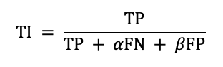
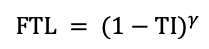
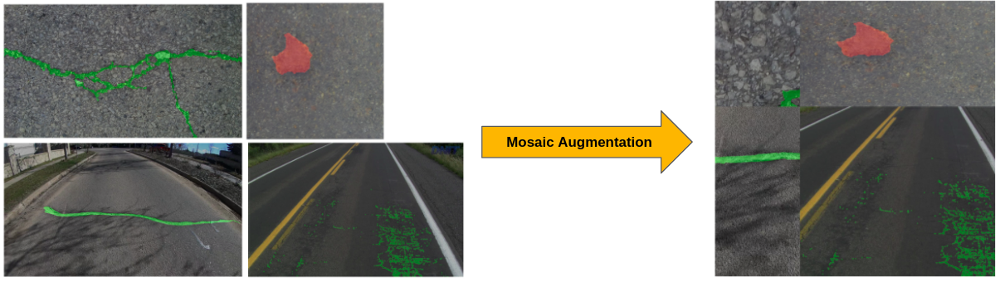
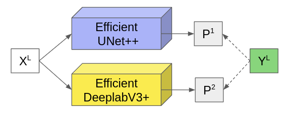
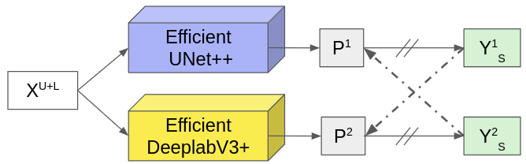

# Submission

- Description for our team's submissions. We approach this task in two ways: fully-supervised and semi-supervised semantic segmentation. Our report adapts well-known state-of-the-art models in segmentation, including Unet++ , DeepLabV3+ and recent SegFormer. In addition, transformer and semi-supervised training strategies are two new approaches that give comparable results. Moreover, additional data sources in the wild are taken advantage of in our experiments. Most of the implementation are based on [Yakubovskiy's segmentation_models.pytorch](https://github.com/qubvel/segmentation_models.pytorch).

## Training strategy
- We conduct many experiment with different augmentation and criterion settings. Finally we highlight some techniques that help us boost up the overall performance of our models. These settings are applied for all the runs we have submitted.

- Highlighted techniques:
    - Combination of Focal Tversky loss and Cross Entropy with Online Hard Example Mining (OHEM) as our objective function. This combined loss increase the precision and recall rate more than standard Cross Entropy loss.
    - To elaborate on the loss combination:
        - Tversky loss weights False Negative (FN) and False Positive (FP) by alpha and beta terms. Because we wanted high recall rate, we penalized FN more.
        - OhemCE only considers top-k highest loss pixels in the predicted masks. This helps the networks not to be overconfident in void pixels. We constrained the $k$ to be equal H xs W x 16.

    
     <strong>Focal Tversky loss</strong> 

    

    - Mosaic augmentation to blend multiple images into a single one. We observe that the dataset lacks of interaction between cracks and potholes (some images are full of cracks with no pothole or vice versa). This help introduce variety of possible situtations where both cracks and potholes present in the same scene, which also help the model generalize better.

    
    <strong>Mosaic augmentation merges 4 input images into one</strong>

## **Run 0: SegFormer**
- We used the group of transformer models because these are state-of-the-arts recently. Moreover, we wanted to check the compatibility and domain adaptation of the transformer model family. Motivation is a transformer family that analyzes the context in the scene, with different contexts and different shooting angles, we can conclude. We use the SegFormer model to enforce the proposed solution. However, the limitation in this group of models is slow convergence. Although the SegFormer is a model with a pretty good calculation in the transformer family, this will inevitably happen, so adapting data through the street domain to identify potholes. In terms of implementation, we inherit pretrained from the Huggingface library.

## **Run 1: Efficient DeepLabV3+**
- In this run, we simply adapt the traditional DeepLabV3+ with some modifications in terms of implementation. In particular, we reused the pretrained EfficientNets \cite{tan2019efficientnet} on the ImageNet dataset as the new backbone and train the whole process with fully-annotated labels.

## **Run 2: Masked Soft Cross Pseudo Supervision**
- In this run, we observe that while run 1 gives overall good metric scores on the validation set, it performs worse when comes to out-of-distribution samples, such as frames from rgbd videos. We alleviate this by strengthening the model with unsupervised data or rather data "in the wild". We inherit ideas from the recent SOTA semi-supervised method: Cross Pseudo Supervision (CPS) and apply with some critical improvements. Instead of using hardcoded pseudo labels, we soften them with softmax normalization and mask out the background channel, hence the name "Masked Soft CPS". The reason behind this is that original CPS uses hard one hot encoding to generate pseudo masks for dual training. We think that would be bad for the performance in this datasets, since models usually confidently predict void pixels. So we softened it, and also masked out the void pixel when training (these pixels are not counted in loss computation), we want one model to only learn the predicted cracks and potholes of the other.

- CPS works by combining both the annotated and non-annotated data and train two neural networks simultaneously (DeepLabV3+ and Unet++ in our experiment). For the annotated samples, supervision loss is applied typically. For the non-annotated, the outputs from one model become the other's targets and are judged also by the supervision loss. The figures bellow illustrate the training pipeline. 

- In the inference stage, we employed ensemble technique by merging the two logits outputed from both networks by getting the max probabilies out of them, then weighted the results by heuristic numbers.

|  Supervised branch | Unsupervised branch |
| :----------------------------------------------------------: | :----------------------------------------------------------: | 
|   |   | 

- Notation explanation: 
    - XL, XU+L: labelled inputs, unlabelled and labelled inputs respectively
    - YL : grouth truth segmentation mask
    - YS : soft pseudo segmentation mask
    - P:            probability maps outputed from networks
    - (&#8212;>):   forward
    - (//) :        stop-gradient
    - (-->):        foss supervision
    - (-&#8901;>):  masked loss supervision

## References

- [REFERENCES.md](./REFERENCES.md)
